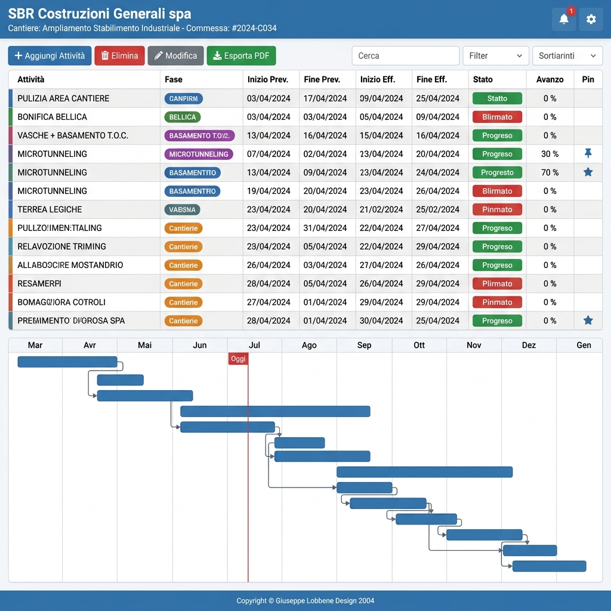
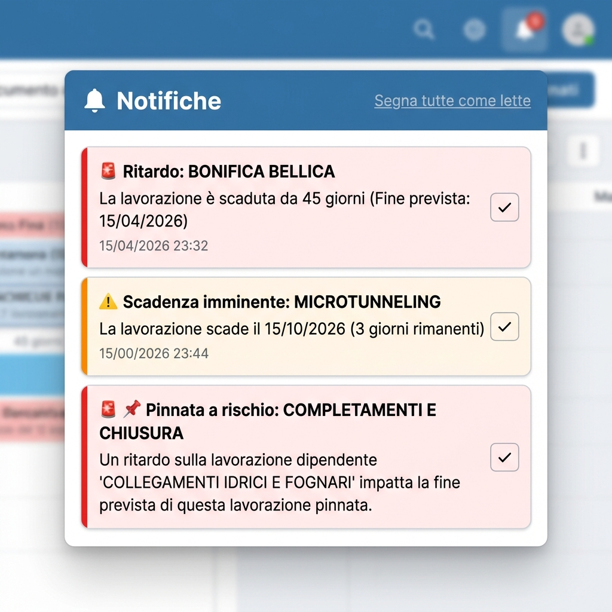
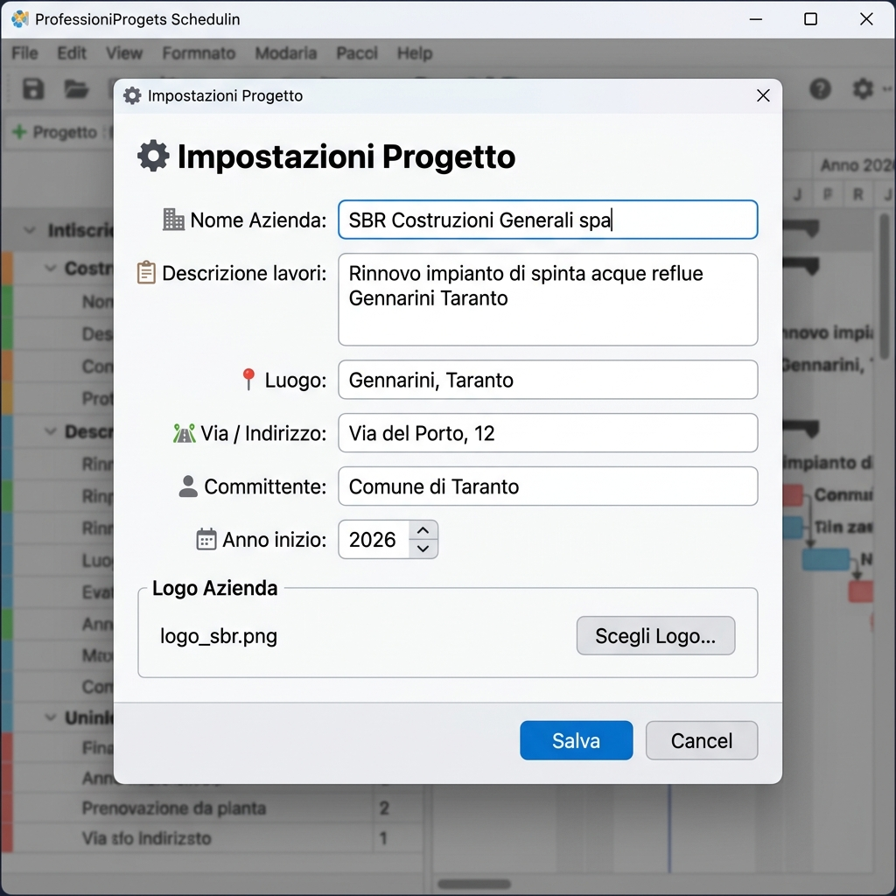

# 📅 Cronoprogramma Lavori

> **Applicazione desktop professionale per la gestione e pianificazione dei lavori di cantiere**, con diagramma di Gantt interattivo, gestione delle dipendenze tra lavorazioni, notifiche intelligenti ed esportazione PDF.

**Copyright © Giuseppe Lobbene Design 2026**

---

## 📸 Screenshot

### Vista Principale – Tabella + Gantt


### Pannello Notifiche


### Modale Impostazioni Progetto


---

## 🚀 Funzionalità Principali

### 🔗 Propedeuticità tra Lavorazioni
Ogni attività può avere una o più **lavorazioni predecessori** (propedeutiche). Se la data di fine di un predecessore supera la data di inizio dell'attività successiva, l'app genera automaticamente un **alert critico** e visualizza nel Gantt una **freccia rossa tratteggiata** che collega le due lavorazioni.

### 📌 Attività Pinnate (Date Fisse)
Le lavorazioni con **date contrattuali inamovibili** (es. collaudi, consegne) possono essere marcate come *pinnate*. Vengono indicate con il badge **📌** sia nella tabella che nel Gantt. Se una dipendenza rischia di compromettere la data fissa, viene generato un **alert critico di priorità massima**.

### 📅 Date Effettive (A Consuntivo)
Oltre alle date **previste**, ogni attività gestisce anche le **date effettive** di inizio e fine (inserite a consuntivo). Nel Gantt vengono visualizzate come una **barra arancione sottile** sovrapposta a quella pianificata, consentendo di rilevare immediatamente scostamenti e ritardi.

### 🔔 Sistema di Notifiche Intelligente
La **campanella** in alto a destra mostra un badge rosso con il numero di notifiche non lette. Cliccando si apre un pannello dropdown con tutti gli alert, classificati per gravità:
- 🚨 **Critico** – Attività in ritardo, conflitti tra dipendenze, attività pinnata a rischio
- ⚠️ **Avviso** – Scadenza entro 7 giorni
- ℹ️ **Informativo** – Aggiornamenti di stato generali

Le notifiche sono **persistenti** e possono essere marcate singolarmente o tutte insieme come lette.

### ⚙️ Impostazioni Progetto
Il modale impostazioni (icona ⚙️ in alto a destra) permette di personalizzare:
- 🏢 Nome azienda
- 📋 Descrizione dei lavori
- 📍 Luogo del cantiere
- 🛣 Via e indirizzo
- 👤 Committente
- 📅 Anno di inizio del cronoprogramma
- 🖼 Logo aziendale (PNG/JPG)

### 🏷️ Fasi di Lavoro
Le attività possono essere categorizzate in **fasi** (Generale, Scavi, Strutture, Impianti, Finiture, Collaudi, Altro). Ogni fase ha un colore distintivo visualizzato nel Gantt e nella tabella.

### 📊 Avanzamento Percentuale
Ogni attività ha un campo **avanzamento** (0–100%). Nel diagramma Gantt la barra mostra un fill proporzionale più scuro con il valore percentuale.

### 📝 Note per Attività
Ogni lavorazione dispone di un campo **note libere** per inserire osservazioni, riferimenti o informazioni aggiuntive.

### 🔍 Filtri e Ricerca
- Barra di ricerca testuale per nome attività
- Filtro per fase
- Filtro per stato (In corso, Completata, Stop, Non iniziata, In ritardo)

### 🖨️ Esportazione PDF Avanzata
Il PDF generato include intestazione con logo, Gantt con barre colorate, avanzamento, date effettive, badge attività pinnate e legenda completa.

### 🖱️ Gantt Interattivo
- **Drag & drop** delle righe per riordinare le attività
- **Doppio click** su una riga per aprire il dettaglio completo
- **Linea rossa "Oggi"** per la posizione corrente nella timeline
- **Frecce di dipendenza** tra lavorazioni propedeutiche

---

## 🛠️ Installazione

### Prerequisiti
- Python 3.10 o superiore

### Clona il repository
```bash
git clone https://github.com/TUO_USERNAME/cronoprogramma.git
cd cronoprogramma
```

### Crea un ambiente virtuale e installa le dipendenze
```bash
python3 -m venv venv
source venv/bin/activate        # macOS/Linux
# oppure: venv\Scripts\activate  # Windows

pip install -r requirements.txt
```

### Avvia l'applicazione
```bash
python3 app.py
```

---

## 📦 Dipendenze

| Pacchetto | Versione | Utilizzo |
|---|---|---|
| `PyQt6` | 6.11.0 | Framework GUI principale |
| `PyQt6-Qt6` | 6.11.1 | Librerie Qt6 native |
| `PyQt6-sip` | 13.11.1 | Binding C++ per PyQt6 |
| `reportlab` | 5.0.0 | Generazione PDF |
| `pillow` | 12.3.0 | Gestione immagini (logo PDF) |
| `charset-normalizer` | 3.4.9 | Encoding testo |

---

## 💾 Struttura del Progetto

```
cronoprogramma/
├── app.py                     # Applicazione principale (~1450 righe)
├── cronoprogramma_data.json   # Dati salvati (generato automaticamente)
├── requirements.txt           # Dipendenze Python
├── images/
│   ├── screenshot_main.png           # Vista principale
│   ├── screenshot_notifications.png  # Pannello notifiche
│   └── screenshot_settings.png       # Modale impostazioni
└── .gitignore
```

---

## 🎯 Casi d'Uso

- **Imprese di costruzioni** – Pianificazione e controllo avanzamento cantieri
- **Project Manager** – Gestione delle dipendenze critiche tra lavorazioni
- **Direzione Lavori** – Monitoraggio scostamenti tra date previste ed effettive
- **Studi tecnici** – Produzione di cronoprogrammi professionali in PDF

---

## 🗺️ Roadmap

- [ ] Gestione multi-progetto
- [ ] Calcolo automatico del Percorso Critico (CPM)
- [ ] Importazione/Esportazione da Excel / Microsoft Project
- [ ] Gestione risorse e costi
- [ ] Dashboard KPI di progetto
- [ ] Versione Web

---

## 📄 Licenza

Questo progetto è di proprietà esclusiva di **Giuseppe Lobbene**.  
**Copyright © Giuseppe Lobbene Design 2026** – Tutti i diritti riservati.

---

*Sviluppato con ❤️ in Python + PyQt6*
